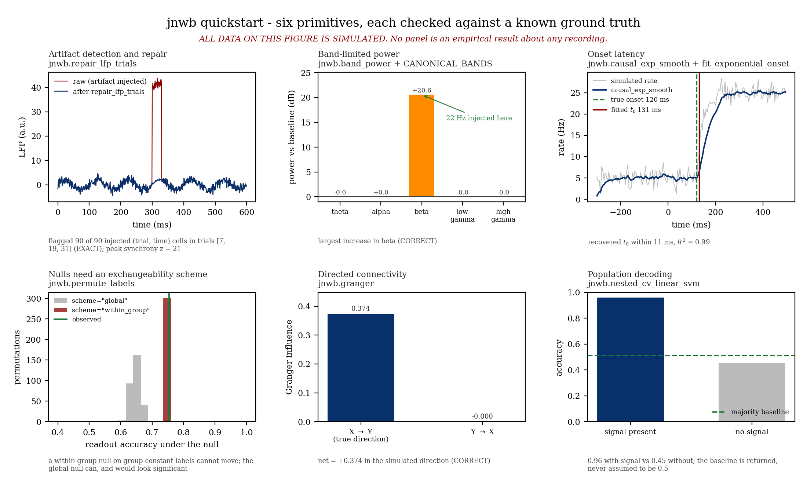

# jnwb

**Dataset-Agnostic Electrophysiology & Time-Frequency Analysis** — High-performance Python library for Neurodata Without Borders (NWB 2.0+) electrophysiology recordings, spectral transformations, spiking onset dynamics, and statistical inference.

**Scientific grammar:** Raw NWB / Arrays → Addressing & QC → Signal & Spectral → Dynamics & Spikes → Statistical Nulls → Directionality & RSA

**Execution grammar:** `Query / Addressing` → `Extraction` → `Preprocessing / Repair` → `Estimator` → `Permutation / Bootstrap` → `Figure / Verification`

All algorithms are mathematically bounded, dataset-agnostic, and guaranteed to operate without condition leakage or hardcoded experiment heuristics.

[Scope & status](01_architecture_and_philosophy.md) · [Public API contract](api.md) (105 symbols) · [Agent Guidance](memory.md)

---

## Install

```bash
pip install -U jnwb
pip install "jnwb[torch,gpu]"   # optional CuPy / PyTorch GPU acceleration
```

## Minimal Example

Compute time-frequency representation (TFR) and band power on continuous electrophysiology:

```python
import jnwb
import numpy as np

# Generate a synthetic neural signal with a 20 Hz oscillation
rng = np.random.default_rng(0)
fs = 1000.0
time = np.arange(1000) / fs
signal = np.sin(2 * np.pi * 20.0 * time) + 0.5 * rng.normal(size=1000)

# Compute multitaper / Welch power spectral density
freqs, psd = jnwb.compute_psd(signal, fs=fs)

# Extract band power in the beta range (14-30 Hz)
beta_power = jnwb.band_power(signal, sampling_rate=fs, freq_range=(14.0, 30.0))
print(f"Beta band power: {beta_power:.4f}")
```

> **Dataset Independence Invariant:** `jnwb` contains zero hardcoded experiment condition names, session IDs, or manuscript findings. All analysis logic accepts generic numeric arrays or standardized NWB data containers.

---

## Main Pages

- [Quickstart](quickstart.md) — 6-primitive runnable tour and visual architecture
- [Installation](install.md) — package setup, hardware backends, and verification
- [Architecture & Philosophy](01_architecture_and_philosophy.md) — design doctrine and frozen boundaries
- [Addressing & Metadata](02_paths_addressing_metadata.md) — probe geometry and unit quality metrics
- [Public API Reference](api.md) — 105 public symbols organized by domain
- [Interactive Analyses](12_interactive_analyses.md) — end-to-end interactive workflows
- [AI Agent Guidance](memory.md) — operational constraints and mechanical gates

---

## Canonical Six-Panel Visual Architecture

The `jnwb` diagnostic suite provides a unified 6-panel visual grammar verifying the six core pillars of electrophysiological data science:

<table>
  <tr>
    <td align="center" width="50%">
      <a href="quickstart.md#1-artifact-detection-repair">
        
      </a><br>
      <sub><b>1. Artifact Repair</b> (OBSERVED): Trial-level artifact detection & interpolation</sub>
    </td>
    <td align="center" width="50%">
      <a href="quickstart.md#2-time-frequency-dynamics-complex-morlet-tfr">
        
      </a><br>
      <sub><b>2. Spectral Dynamics</b> (DERIVED): Complex Morlet wavelet time-frequency decomposition</sub>
    </td>
  </tr>
  <tr>
    <td align="center" width="50%">
      <a href="quickstart.md#3-directed-information-flow-phase-slope-index">
        
      </a><br>
      <sub><b>3. Directed Interaction</b> (DERIVED): Phase slope index with surrogate significance</sub>
    </td>
    <td align="center" width="50%">
      <a href="quickstart.md#4-spiking-psth-onset-dynamics">
        
      </a><br>
      <sub><b>4. Spiking Latencies</b> (DERIVED): PSTH bootstrap and exponential onset fitting</sub>
    </td>
  </tr>
  <tr>
    <td align="center" width="50%">
      <a href="quickstart.md#5-non-parametric-statistical-testing">
        
      </a><br>
      <sub><b>5. Hypothesis Testing</b> (DERIVED): Non-parametric permutation tests and Clopper-Pearson CIs</sub>
    </td>
    <td align="center" width="50%">
      <a href="quickstart.md#6-joint-representational-similarity-jrsa">
        
      </a><br>
      <sub><b>6. Representational Geometry</b> (DERIVED): Cross-modal representational similarity analysis</sub>
    </td>
  </tr>
</table>

Generate the complete standalone diagnostic figure locally with one line:

```bash
python examples/quickstart_jnwb.py
```
